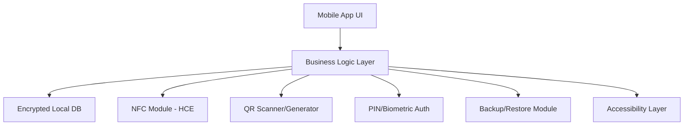

# 📱 Offline Card Wallet

**Offline Card Wallet** is a professional, open-source mobile application for Android and iOS that securely stores your card details offline and enables convenient Tap-to-Pay (NFC) and QR-based payments. Designed for personal use, it eliminates the need to carry physical cards and works entirely offline for maximum privacy and security.

---

## Table of Contents

1. [Overview](#overview)
2. [Features](#features)
3. [Architecture](#architecture)
4. [Technology Stack](#technology-stack)
5. [Installation](#installation)
6. [Usage](#usage)
7. [Security](#security)
8. [Requirements](#requirements)
9. [Roadmap](#roadmap)
10. [Contributing](#contributing)
11. [License](#license)
12. [Contact](#contact)

---

## Overview

Offline Card Wallet is an offline-first, privacy-focused digital wallet for storing and using payment, loyalty, and membership cards. Unlike commercial apps, it does not require an internet connection and is intended for personal use and experimentation.

---

## Features

- **Secure Card Storage**: Add cards manually or via camera scan. Data is encrypted locally using AES-256 and protected by PIN or biometric authentication.
- **Tap-to-Pay (NFC, Android only)**: Experimental Host Card Emulation (HCE) lets you simulate card payments at supported NFC terminals.
- **QR Payments**: Scan merchant QR codes for payments or generate QR codes to share card/transaction details.
- **Loyalty & Membership Cards**: Store and display non-banking cards (loyalty, membership, ID barcodes) for easy checkout.
- **Transaction Logs**: Maintain a local, offline history of all QR/NFC interactions.
- **Offline Operation**: All features work without internet access.
- **Multi-language Support**: Easily switch between languages for global usability.
- **Dark Mode**: User-friendly interface with dark mode support.
- **Card Backup & Restore**: Export/import encrypted card data for device migration.
- **Customizable Card Categories**: Organize cards by type, color, or tags.
- **Cross-Platform Sync (Planned)**: Securely sync cards between devices using encrypted local transfer.
- **Accessibility Features**: High-contrast mode, screen reader support, and large text options.

---

## Architecture



---

## Technology Stack

- **Frontend:** React Native (cross-platform mobile app)
- **Database:** SQLite (encrypted with SQLCipher)
- **Security:** Android Keystore / iOS Keychain
- **Payment Tech:**
  - NFC (Host Card Emulation – Android only)
  - QR (scan & generate, offline)
- **Navigation:** React Navigation v6
- **Testing:** Jest, React Native Testing Library
- **CI/CD:** GitHub Actions, Fastlane

---

## Installation

### Prerequisites

- **React Native Development Environment:**
  - Node.js (v16 or higher)
  - React Native CLI
  - Android Studio (for Android development)
  - Xcode (for iOS development, macOS only)
- **Mobile Device or Emulator:**
  - Android device/emulator (API level 26+)
  - iOS device/simulator (iOS 13+)

### Steps

```bash
# Clone the repository
git clone https://github.com/umairism/offline-card-wallet.git
cd offline-card-wallet

# Install dependencies
npm install

# For Android
npx react-native run-android

# For iOS (macOS only)
cd ios && pod install && cd ..
npx react-native run-ios
```

### Development Setup

1. **Android Setup:**
   - Install Android Studio
   - Set up Android SDK (API 26+)
   - Enable Developer Options and USB Debugging on your device

2. **iOS Setup (macOS only):**
   - Install Xcode
   - Install CocoaPods: `sudo gem install cocoapods`
   - Run `cd ios && pod install`

---

## Usage

1. Launch the app on your device.
2. Set up a secure PIN or enable biometric authentication.
3. Add your cards manually or scan them using the camera.
4. Use NFC Tap-to-Pay (Android) or QR payments at supported merchants.
5. View transaction logs and manage your cards offline.
6. Backup your cards and restore on another device if needed.

---

## Security

- All sensitive data is encrypted with AES-256.
- Master encryption key is stored in Android Keystore or iOS Keychain.
- No plain-text storage of card data.
- Biometric authentication is optional but highly recommended.
- The app does not transmit or store data externally.
- Regular security audits and code reviews.

---

## Requirements

- Android 8.0 (Oreo) or higher / iOS 13 or higher
- Minimum 2GB RAM
- Camera (for card/QR scanning)
- NFC hardware (for Tap-to-Pay)
- Internet connection only required for initial setup or updates
- Accessibility features enabled for users with disabilities

---

## Roadmap

- [x] Secure offline card storage
- [x] QR code scanner & generator
- [ ] NFC Tap-to-Pay (Android HCE prototype)
- [ ] Loyalty/Membership card support
- [ ] Transaction history log
- [ ] UI/UX improvements
- [ ] Automated tests & CI/CD
- [ ] Multi-language support
- [ ] Card backup & restore
- [ ] Dark mode
- [ ] Cross-platform sync
- [ ] Accessibility improvements

---

## Contributing

Contributions are welcome! Please open issues for bugs or feature requests, and submit pull requests for improvements. See [CONTRIBUTING.md](CONTRIBUTING.md) for guidelines.

---

## License

This project is licensed under the MIT License. See [LICENSE](LICENSE) for details.

---

## Contact

For questions, feedback, or collaboration, please contact:

- **Author:** Umair Hakeem
- **Email:** iamumair1124@gmail.com
- **GitHub:** [Umairism](https://github.com/umairism)

---

## Disclaimer

This project is for personal use and educational purposes only. It is not PCI-DSS compliant and must not be used as a production-ready financial product. Any resemblance to commercial apps (Google Pay, Apple Pay, JazzCash, Easypaisa) is purely conceptual.
